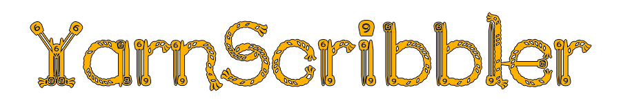
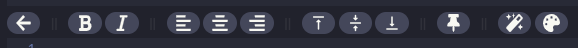

# About
YarnScribbler is a modifier version of [YarnEditor](https://github.com/YarnSpinnerTool/YarnEditor) meant to be used with JujuAdam's [Scribble](https://github.com/JujuAdams/Scribble) and [Chatterbox](https://github.com/JujuAdams/chatterbox) libraries for GameMaker Studio 2.3+. It strips away unnecessary features from YarnEditor and implements Scribble's own brand of markup to make the Yarn -> Chatterbox -> Scribble pipeline more efficient and fun.

# Scribble Markup
YarnScribbler supports auto close tags for a variety of [Scribble text formatting options](https://github.com/JujuAdams/Scribble/wiki/Text-Formatting). Below is a table of tags that will autocomplete if you type the starting phrase.

Formatting Option | Starting Phrase | Autocompleted Phrase &nbsp; &nbsp; &nbsp; &nbsp; &nbsp; &nbsp; &nbsp; &nbsp; &nbsp; &nbsp; | Notes
----------------- | ------------- | ---------------------------------------------------------------------------------------- | -----
Bold | `[b` | `[b][/]` | Must have a bold font defined with `scribble_font_set_style_family(regular, bold, italic, boldItalic)`.
Italic | `[i]` | `[i][/]` | Must have an italic font defined with `scribble_font_set_style_family(regular, bold, italic, boldItalic)`.
Bold-Italic | `[bi` | `[bi][/]` | Must have a bold-italic font defined with `scribble_font_set_style_family(regular, bold, italic, boldItalic)`.
Slant | `[slant` | `[slant][/slant]` | This is a sort of fake italic you can use if you don't have an italic font defined.
Color | `[#` | `[#<color>][/c]` | This will open the color picker popup to insert the chosen hex color code.
Scale | `[scale` | `[scale, ][/scale]` | Argument should be provided.  e.g. `[scale, 2][/scale]`
Blink | `[blink` | `[blink][/blink]`
Cycle | `[cycle` | `[cycle, ][/cycle]` | This can take up to four hue arguments.  e.g. `[cycle, hue1, hue2, hue3, hue4][/cycle]`
Jitter | `[jitter` | `[jitter][/jitter]`
Rainbow | `[rainbow` | `[rainbow][/rainbow]`
Shake | `[shake` | `[shake][/shake]`
Wave | `[wave` | `[wave][/wave]`
Wheel | `[wheel` | `[wheel][/wheel]`
Wobble | `[wobble` | `[wobble][/wobble]`

There are also various buttons available on the editor toolbar that are Scribble specific.

Bold & Italic | Align left, center, right | Align top, middle, bottom | Pin Options | Insert Effect & The Color Picker
------------- | ------------------------- | ------------------------- | ----------- | --------------------------------

# Feedback Requested
Please feel free to reach out to me either on Discord (Faulty#1456 or [Juju's Discord Server](https://discord.gg/8krYCqr)), Twitter (@FaultyFunctions), or open up an issue on here to provide feedback. Thanks!
